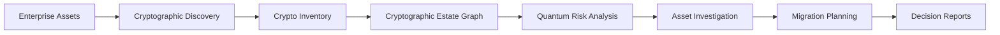

# ECDAT

### Enterprise Cryptographic Discovery & Analysis Tool

> ECDAT is a cryptographic discovery and migration-planning platform. It helps organizations discover where cryptography is being used across their software systems, understand which cryptographic assets may become vulnerable in a post-quantum world, trace their impact across dependent services, and plan an actionable migration towards quantum-safe cryptography.

---

## Tech Stack

<p align="center">
  
</p>

**Frontend:** Next.js, React, TypeScript, D3.js  
**Backend:** Python, FastAPI  
**Data:** PostgreSQL, Neo4j, Redis  
**Infrastructure:** Docker & Docker Compose

---

## The Problem

Large organizations may use cryptography across thousands of applications, certificates, dependencies, configuration files and services.

Before migrating towards post-quantum cryptography, an organization first needs to answer questions such as:

- Where is cryptography being used?
- Which algorithms and keys are currently deployed?
- Where was each cryptographic asset discovered?
- Which systems depend on it?
- Which assets are vulnerable to quantum attacks?
- Which long-lived encrypted data may already have **Harvest Now, Decrypt Later (HNDL)** exposure?
- What should be migrated first?
- What dependencies could block the migration?

ECDAT is designed to connect these questions into one workflow.

---

## What ECDAT Does



Organizations can provide source repositories, archives, configurations, certificates, CycloneDX BOMs and supported container-image archives.

ECDAT analyzes the supplied evidence and builds an inventory of discovered cryptographic assets. It then connects those assets to affected systems, evaluates quantum-risk planning scenarios and generates dependency-aware migration recommendations.

---

## Key Features

- Evidence-backed cryptographic discovery
- Cryptographic asset inventory
- Interactive dependency and exposure graph
- Exact evidence and source-location tracing
- Quantum-vulnerability analysis
- Mosca-style migration urgency assessment
- Harvest Now, Decrypt Later exposure analysis
- Adjustable quantum-risk planning scenarios
- Asset-level investigation workflow
- Crypto-agility / migration-readiness assessment
- Dependency-aware migration roadmap
- Assessment history and comparison
- Executive and technical decision reports
- CycloneDX and CSV exports
- Enterprise archive and BOM intake

---

## Product Workflow

A typical assessment follows this path:

**New Assessment → Discovery → Cryptographic Estate → Quantum Exposure → Asset Investigation → Migration Readiness → Migration Roadmap → Decision Report**

ECDAT also includes a reference enterprise assessment so the complete workflow can be explored without providing external data.

---

## Running the Project

The only major requirement for running the complete stack is:
- Docker
- Docker Compose

1. Clone the repository
2. Create env file `cp .env.example .env` (Linux) or `copy .env.example .env` (WINDOWS)
3. Build & start the application: `sudo docker compose up -d --build` (LINUX) or `docker compose up -d --build` (WINDOWS)
4. Then open at `http://localhost:3000`

**If u wanna verify functioning as a dev**
```bash
sudo docker compose ps
sudo make test
sudo make verify
```

---

## Reference Assessment

For demonstration and testing, ECDAT contains a fictional enterprise reference estate.

It contains proper cryptographic configurations, dependencies, certificates and service relationships designed to exercise the platform's discovery and analysis pipeline.


---

## Important

> *ECDAT is a hackathon prototype and decision-support system. Quantum-risk horizons are planning assumptions, not predictions of when a cryptographically relevant quantum computer will exist. Scanner coverage and confidence should also be considered when interpreting an assessment.The platform is intended to help security and modernization teams investigate and prioritize cryptographic migration—not replace expert security review.*

---

## Team

This project was developed as a functional hackathon prototype for **Smart India Hackathon 2026.**


---

## License

This project is licensed under the GPL-3.0 License - see the [LICENSE](LICENSE) file for details.