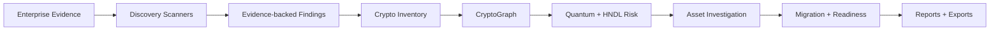
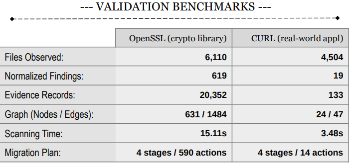

# QDeX 

### Enterprise Cryptographic Discovery & Analysis Tool

**SIH26164 · Smart India Hackathon 2026**

We built QDeX because post-quantum migration has a pretty obvious first problem:

> **you can't migrate cryptography you don't even know you're using.**

In a real company, crypto is scattered everywhere — source code, dependencies, certificates, TLS configs, container images, BOMs, cloud/KMS inventories, old services nobody wants to touch, and probably three places everyone forgot existed.

QDeX takes the evidence an organization already has, finds the cryptography inside it, keeps track of *where every finding came from*, maps what depends on what, works out what actually needs attention for the quantum era, and turns that into a migration plan people can act on.

So basically, we wanted to go further than:

`RSA found → big red warning → good luck`

---

**CHECK OUR DEMONSTRATION:** `https://youtu.be/S3RTA8bBaos`

---

## What we actually built



An assessment can combine multiple kinds of input, including:

- source repositories / archives
- dependency manifests and configuration files
- certificates
- CycloneDX BOMs
- offline Docker / OCI image archives
- binaries (with clearly marked heuristic limits)
- TLS endpoint inventory exports
- Cloud KMS inventory exports
- enterprise PKI inventory exports
- optional `ecdat.context.json` for business/service context

Every source keeps its own provenance. If the same cryptographic asset shows up through multiple sources, we correlate it instead of pretending they are unrelated findings — while still keeping the original evidence.

---

### BENCHMARKED ON REAL WORLD REPOS



---

## What QDeX can do

- discover cryptographic usage across multiple enterprise artifact types
- normalize findings into a canonical crypto inventory
- retain exact evidence + source provenance
- build a provenance-aware **CryptoGraph** of services, libraries, certificates, algorithms, data and dependencies
- classify quantum posture for RSA/ECC/DH-family crypto, symmetric crypto and standardized PQC
- model **Harvest Now, Decrypt Later (HNDL)** exposure separately instead of flagging everything blindly
- run adjustable Mosca-style planning scenarios using data lifetime, migration time and a selected quantum horizon
- investigate an individual crypto asset all the way from evidence → affected systems → risk → migration action
- calculate migration readiness / crypto agility
- recommend standards-based paths such as **ML-KEM, ML-DSA, SLH-DSA** and hybrid TLS where appropriate
- generate **evidence-prioritized stages** when dependency context is missing
- generate **dependency-aware migration waves** when trustworthy enterprise topology is available
- preserve assessment history and migration-plan revisions per organization
- export executive reports, finding-register CSVs and CycloneDX cryptographic BOM data
- support local authentication, organization isolation, RBAC, invitations and multi-workspace users

---

## Stages vs Waves 

> (yes, we intentionally made these different)

We did **not** want the roadmap to fake precision. If QDeX only has technical evidence, it can tell you what is urgent and group work into sensible **execution stages**. But it cannot honestly claim it knows the company's real deployment order. If reviewed enterprise dependencies are supplied, then QDeX can build **migration waves** with prerequisites, blockers and a defensible critical path.

**Priority answers “what needs attention first?”**  
**Waves answer “what order can we realistically change this in?”**

---

## Quantum risk, without pretending we know the future

QDeX treats major classical public-key families such as RSA, DH, ECDH, ECDSA and related ECC schemes as quantum-vulnerable for planning purposes. Strong symmetric/hash crypto is handled differently, and standardized PQC algorithms are treated as the migration baseline.

For timing, we use the simple planning model:

```text
X = how long the data must stay protected
Y = how long migration is expected to take
Z = the organization's selected quantum planning horizon

X + Y > Z  ->  migration urgency / overlap
```

`Z` is a planning assumption, **not us predicting the exact year a cryptographically relevant quantum computer appears.**

---

## Tech stack

<p align="center">
  
</p>

**Frontend** — Next.js 15, React 19, TypeScript, D3.js  
**Backend** — Python 3.12+, FastAPI, Pydantic, SQLAlchemy  
**Data** — PostgreSQL 16, Neo4j 5, Redis 7  
**Workers** — Dramatiq  
**Infrastructure** — Docker + Docker Compose

The complete local stack runs as:

`web · api · worker · postgres · redis · neo4j`

---

## RUNNING IT

You mainly need **Docker** and **Docker Compose**.

```bash
git clone <repo-url>
cd <repo-folder>
cp .env.example .env
sudo docker compose up -d --build
```

Then open:

```text
http://localhost:3000
```

On the first launch, QDeX takes you through secure setup for the first organization and its Organization Administrator. After that, users sign in normally; additional users are invitation-only.

### Roles

- **Organization Administrator** — workspace/member management + all assessment actions
- **Security Architect / Analyst** — assessments, investigation, risk scenarios, migration, readiness and reports
- **Viewer / Executive** — read-only access

For local HTTP development, `ECDAT_AUTH_COOKIE_SECURE=false` is expected. Turn it on when deploying behind HTTPS.

### DEV CHECKS

```bash
sudo docker compose ps
sudo make test
sudo make verify
```

Other useful targets:

```bash
sudo make validate-discovery
sudo make benchmark
sudo make sample
```

---

## Demo / reference estate

We ship a fictional enterprise estate under:

```text
sample/asteria-financial/
```

It exists so we can demo the entire pipeline — discovery, evidence, graph relationships, HNDL, risk scenarios, migration blockers, readiness, reporting and multi-wave planning — without needing anyone's real enterprise data.

Important bit: the demo is still just **input**. It goes through the same pipeline as normal assessments; the results are not hardcoded.

---

## LIMITATIONS (CURRENT)

We would rather be clear about this than oversell a hackathon project.

QDeX does **not** currently claim to be:

- a full live runtime instrumentation platform
- a universal reverse-engineering / deep binary analysis suite
- an automatic login-and-scan integration for every cloud/KMS/HSM/PKI product
- a system that somehow knows business criticality or dependency topology without being given that context
- a predictor for the exact date of a cryptographically relevant quantum computer
- proof that every recommended migration will work without vendor, compatibility and performance testing

Binary analysis is heuristic, static evidence has limits, and those limits are meant to stay visible in the product.

---

## Connecting The Whole Story

Not just:

> “We found RSA.”

But:

> “We found RSA **here**, from **this evidence**. It affects **these systems**. Under **these explicit assumptions**, it has **this priority**. These dependencies may block the change. Here is the standards-based target, and here is a migration order we can actually defend.”

That is basically QDeX .

---

## Team

Built as a functional student hackathon project for **Smart India Hackathon 2026 (SIH26164)**.

---

## License

Licensed under **GPL-3.0**. See [LICENSE](LICENSE) for details.
